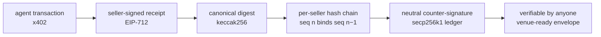

<p align="center">
  <a href="https://tersign.ai"></a>
</p>

<p align="center">
  <a href="https://www.npmjs.com/package/tersign"></a>
  <a href="https://github.com/tersignhq/tersign-js/blob/main/LICENSE"></a>
  
  
</p>

**Tersign is the evidence layer for the agent economy** — a neutral, counter-signed, hash-chained ledger for agent commerce. Sellers sign EIP-712 receipts; Tersign chains them per seller and counter-signs every entry. When the dispute comes, the transcript is already sealed.

> **Venues rotate. The transcript endures.**

---

## Verify a Real Entry — Right Now

No account. No API key. This is the genesis receipt, `seq 1` on the production chain:

```sh
npx tersign verify 0xe5874f1ffe87f0a6dd9eb157730f67b86ee4538b125fe30fcc4e165213dd3fc4 --ledger https://tersign.ai
```

```text
ledger: counter-signed OK (seller tersign-first, seq 1 …) VALID
```

`npx tersign verify <receipt.json | 0xdigest> [--ledger url]` recovers the EIP-712 signature **locally**, then checks the entry against the public chain — yours or anyone's. Prefer raw HTTP? The same proof, no CLI:

```sh
curl https://tersign.ai/v1/receipts/0xe5874f1ffe87f0a6dd9eb157730f67b86ee4538b125fe30fcc4e165213dd3fc4/verify
```

## Chain of Custody

Every entry takes the same path: the seller **signs** the receipt (EIP-712, x402 offer-receipt extension) → Tersign computes the **keccak256 canonical digest** → the digest joins that **seller's hash chain**, each `seq n` bound to `seq n−1` → the neutral ledger **counter-signs** (secp256k1) → **anyone verifies**, and any venue gets a serialized envelope.



<sub>Diagram renders on GitHub. On npm, the paragraph above IS the diagram.</sub>

Refunds chain back to the original receipt via `refundOf`. Disputes attach to the digest with objective reason codes. Party statements are structurally segregated behind an `UNVERIFIED` marker — the evidence stays prompt-injection-hardened.

## Enter the Record

```sh
npm i tersign
```

`withAssure()` wraps your x402 fetch handler so every paid call issues a signed, chained receipt. The full register:

| Capability | In the record |
|---|---|
| Receipts | Seller-signed EIP-712 (x402 offer-receipt extension), keccak256 canonical digests |
| `withAssure()` | x402 fetch-handler adapter — a receipt per paid call |
| Compliance records | EU Art-226b minimal tier · EN 16931 full tier · HK IRO s.51C retention |
| Action records | `ActionRecordV1` — GDPR-minimized, EU AI Act Art-50 mapped (Art 50 binds 2026-08-02) |
| Refunds | Chained to the original receipt via `refundOf` |
| Disputes v0 | Objective reason codes, evidence submission, adjudication |
| Venue envelopes | Internet Court (5,000-char slot) · Kleros ERC-1497 · UMA · generic |
| Evidence packs | `format=art50` · `format=safr` (beta) |
| Idempotency | In-memory + Cloudflare D1 stores |

## For Agents — the MCP Server

`npx tersign` starts the MCP server (stdio). Official registry entry: `io.github.tersignhq/evidence` (active).

```json
{
  "mcpServers": {
    "tersign": {
      "command": "npx",
      "args": ["tersign"],
      "env": { "TERSIGN_SELLER_KEY": "0x<your-seller-key>" }
    }
  }
}
```

**Tools** — `issue_receipt` · `verify_receipt` · `verify_compliance_record` · `record_refund` · `open_dispute` · `submit_dispute_evidence` · `adjudicate_dispute` · `get_dispute`

| Env var | Required | Purpose |
|---|---|---|
| `TERSIGN_SELLER_KEY` | yes | 0x-prefixed private key that signs your receipts and records |
| `TERSIGN_LEDGER_URL` | no | hosted ledger for counter-signing + chain checks |
| `TERSIGN_LEDGER_API_KEY` | no | your seller API key on that ledger |
| `TERSIGN_LEDGER_SELLER_ID` | no | your seller id on that ledger |
| `TERSIGN_ISSUER_NAME` | no | issuer name stamped on compliance records |
| `TERSIGN_ISSUER_JURISDICTION` | no | issuer jurisdiction stamped on compliance records |

Cold to counter-signed in one session: call `issue_receipt`, then check the issued receipt's digest with `npx tersign verify <digest> --ledger <url>`.

The agent skill `tersign-evidence` ships at [tersignhq/skills](https://github.com/tersignhq/skills).

## The Live Record

- **Ledger + dashboard** — public verify page: https://tersign.ai/verify
- **Census** — 1,500+ hash-chained observations across 1,000+ x402 seller endpoints, probed hourly and autonomously. Live counts: https://prober.tersign.ai/v1/prober/stats

## Machine Surfaces

Full URLs, readable without auth. If you are an agent, start here.

| Surface | Address |
|---|---|
| npm package | `tersign` — https://www.npmjs.com/package/tersign |
| MCP registry | `io.github.tersignhq/evidence` |
| ARD catalog (Agentic Resource Discovery) | https://tersign.ai/.well-known/ai-catalog.json |
| Verify API | `GET https://tersign.ai/v1/receipts/{digest}/verify` |
| Envelope API | `GET https://tersign.ai/v1/receipts/{digest}/envelope?venue={internet-court\|kleros\|uma\|generic}` |
| Ledger stats | `GET https://tersign.ai/v1/stats` |
| Ledger signer | `GET https://tersign.ai/v1/ledger` |
| llms.txt | https://raw.githubusercontent.com/tersignhq/tersign-js/main/llms.txt |
| Genesis verify | `npx tersign verify 0xe5874f1ffe87f0a6dd9eb157730f67b86ee4538b125fe30fcc4e165213dd3fc4 --ledger https://tersign.ai` |

---

<p align="center">
  
</p>

<p align="center"><sub>MIT · built and published from <a href="https://github.com/tersignhq/tersign-js">tersignhq/tersign-js</a> via trusted-publishing CI, provenance attested · <code>tersign</code> reserved on PyPI</sub></p>

<p align="center"><sub><b>Venues rotate. The transcript endures.</b></sub></p>
