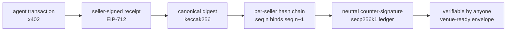

<p align="center">
  <a href="https://tersign.ai"></a>
</p>

<p align="center">
  <a href="https://www.npmjs.com/package/tersign"></a>
  <a href="https://github.com/tersignhq/tersign-js/blob/main/LICENSE"></a>
  
  
</p>

**Tersign is the evidence layer for the agent economy** — a neutral, counter-signed, hash-chained ledger for agent commerce. Sellers sign EIP-712 receipts; Tersign chains them per seller and counter-signs every entry. When the dispute comes, the transcript is already sealed.

> **Venues rotate. The transcript endures.**

---

## Verify a Real Entry — Right Now

No account. No API key. This is the genesis receipt, `seq 1` on the production chain:

```sh
npx tersign verify 0xe5874f1ffe87f0a6dd9eb157730f67b86ee4538b125fe30fcc4e165213dd3fc4
```

```text
ledger: counter-signed OK (seller tersign-first, seq 1 …) VALID
```

`npx tersign verify <receipt.json | 0xdigest> [--ledger url]` recovers the EIP-712 signature **locally**. A bare digest is then checked against the Tersign ledger unless `--ledger` names another; a receipt file verifies offline and touches no chain at all. The ledger consulted is always printed. Prefer raw HTTP? The same proof, no CLI:

```sh
curl https://tersign.ai/v1/receipts/0xe5874f1ffe87f0a6dd9eb157730f67b86ee4538b125fe30fcc4e165213dd3fc4/verify
```

## One-Call Disclosure Evidence

Counter-signed evidence that your agent presented a disclosure — one command, no account:

```sh
npx tersign disclose "You are chatting with an AI assistant." --medium chat --agent-id my-agent
```

The text is digested **locally** (only the digest travels — data-minimization by construction). Your key signs the record; the ledger counter-signs it into a per-signer hash chain whose head is submitted for Bitcoin anchoring on a six-hourly cron. First call self-provisions a free signer-keyed account bound set-once to your key (key resolution: `TERSIGN_SELLER_KEY` env → macOS keychain `tersign-signer` → `~/.tersign/signer.key`, created on first use). Free tier is quota- and rate-limited — [limits](https://tersign.ai/pricing). What this is: independently verifiable evidence the disclosure was attested at that time. What it is not: a compliance certification.

## Chain of Custody

Every entry takes the same path: the seller **signs** the receipt (EIP-712, x402 offer-receipt extension) → Tersign computes the **keccak256 canonical digest** → the digest joins that **seller's hash chain**, each `seq n` bound to `seq n−1` → the neutral ledger **counter-signs** (secp256k1) → **anyone verifies**, and any venue gets a serialized envelope.

Since 2026-08-28 each anchor stamps a chain commitment — an accumulator over every counter-signed link — so one anchored digest covers the whole prefix; rows anchored earlier bind the head record only and say so (`subjectSchema`).


```mermaid
graph LR
    A["agent transaction<br/>x402"] --> B["seller-signed receipt<br/>EIP-712"]
    B --> C["canonical digest<br/>keccak256"]
    C --> D["per-seller hash chain<br/>seq n binds seq n−1"]
    D --> E["neutral counter-signature<br/>secp256k1 ledger"]
    E --> F["verifiable by anyone<br/>venue-ready envelope"]
```

<sub>Diagram renders on GitHub. On npm, the paragraph above IS the diagram.</sub>

Refunds chain back to the original receipt via `refundOf`. Disputes attach to the digest with objective reason codes. Party statements are structurally segregated behind an `UNVERIFIED` marker — the evidence stays prompt-injection-hardened.

## Enter the Record

```sh
npm i tersign
```

`withAssure()` wraps your x402 fetch handler so every paid call issues a signed, chained receipt. The full register:

| Capability | In the record |
|---|---|
| Receipts | Seller-signed EIP-712 (x402 offer-receipt extension), keccak256 canonical digests |
| `withAssure()` | x402 fetch-handler adapter — a receipt per paid call |
| Compliance records | EU Art-226b minimal tier · EN 16931 full tier · HK IRO s.51C retention |
| Action records | `ActionRecordV1` — GDPR-minimized; captures the content of an Art-50 disclosure so the disclosure itself is independently attested, not self-reported |
| Refunds | Chained to the original receipt via `refundOf` |
| Disputes v0 | Objective reason codes, evidence submission, adjudication |
| Venue envelopes | Internet Court (5,000-char slot) · Kleros ERC-1497 · UMA · generic |
| Evidence packs | `format=art50` · `format=safr` (beta) |
| Idempotency | In-memory + Cloudflare D1 stores |
| `tersign intercept` | Audit capture at the MCP boundary — a signed, digest-only action record per tool call (experimental) |

## Capture at the MCP Boundary — `tersign intercept`

An agent's tool calls are usually recorded, if at all, by the party running the agent. Put a
recording clamp on the wire instead:

```sh
npx tersign intercept -- npx your-mcp-server
```

The proxy is a **pure observer**: bytes reach the server and the client exactly as sent, in
order, unmodified. Every `tools/call` it sees becomes an `ActionRecordV1` signed by *your* key
and counter-signed into a hash chain — **digests only**, so the record proves what happened
without carrying arguments or results anywhere. Records go to a configured ledger, and fall
back to a local `~/.tersign/intercepts-<date>.jsonl` so evidence is never silently dropped.

Experimental, and deliberately unopinionated about where the protocol lands: it implements the
observation semantics of the audit-mode validator described in MCP **SEP-2624** (Draft) as a
transport-level proxy today, and is structured to move onto the interceptor primitive if and
when that stabilizes. It makes no conformance claim to that draft.

## For Agents — the MCP Server

`npx tersign` starts the MCP server (stdio). Official registry entry: `io.github.tersignhq/evidence` (active).

```json
{
  "mcpServers": {
    "tersign": {
      "command": "npx",
      "args": ["tersign"],
      "env": { "TERSIGN_SELLER_KEY": "0x<your-seller-key>" }
    }
  }
}
```

**Tools** — `issue_receipt` · `verify_receipt` · `verify_compliance_record` · `record_disclosure` · `record_refund` · `open_dispute` · `submit_dispute_evidence` · `adjudicate_dispute` · `get_dispute`

| Env var | Required | Purpose |
|---|---|---|
| `TERSIGN_SELLER_KEY` | yes | 0x-prefixed private key that signs your receipts and records |
| `TERSIGN_LEDGER_URL` | no | hosted ledger for counter-signing + chain checks |
| `TERSIGN_LEDGER_API_KEY` | no | your seller API key on that ledger |
| `TERSIGN_LEDGER_SELLER_ID` | no | your seller id on that ledger |
| `TERSIGN_ISSUER_NAME` | no | issuer name stamped on action records |
| `TERSIGN_ISSUER_JURISDICTION` | no | issuer jurisdiction stamped on action records |

Cold to counter-signed in one session: call `issue_receipt`, then check the issued receipt's digest with `npx tersign verify <digest> --ledger <url>`.

The agent skill `tersign-evidence` ships at [tersignhq/skills](https://github.com/tersignhq/skills).

## The Live Record

- **Ledger + dashboard** — public verify page: https://tersign.ai/verify
- **Census** — hash-chained observations across the live x402 seller catalog, probed autonomously; the numbers are served live, never quoted stale: https://prober.tersign.ai/v1/prober/stats
- **Conformance** — RFC 8785 (JCS) canonical serialization, keccak256 digests, and the public two-sided vector suite (canonical bytes, number domain, content address, chain continuity, completeness, anchored existence, phase separation, offer binding, independence — every criterion carrying both an accepting and an adversarial vector): [tersignhq/evidence-record-conformance](https://github.com/tersignhq/evidence-record-conformance). Reproduce the bytes and your implementation is conformant — in any language.
- **Standards** — the `compliance-fields` extension — a typed compliance-record schema plus four evaluator-side disqualifications (independence, completeness/existence, economic-phase separation, and commitment scope — an independence claim reaches exactly as far as the record's own commitments), each executable as a two-sided conformance vector — is under review upstream ([x402-foundation/x402#2853](https://github.com/x402-foundation/x402/pull/2853)) and referenced in the x402 TSC's evidence-record charter agenda ([tsc#4](https://github.com/x402-foundation/tsc/issues/4)). The merged offer-receipt spec already carries post-session verification guidance — signer authorization evaluated as of `issuedAt`, with mutable-source rotation handled explicitly ([#2811](https://github.com/x402-foundation/x402/pull/2811), merged); the completeness, independence, existence and phase disqualifications are the open extension's normative core.

## Machine Surfaces

Full URLs, readable without auth. If you are an agent, start here.

| Surface | Address |
|---|---|
| npm package | `tersign` — https://www.npmjs.com/package/tersign |
| MCP registry | `io.github.tersignhq/evidence` — `npx tersign` needs no configuration; the first call self-provisions a signer-keyed account |
| ARD catalog (Agentic Resource Discovery) | https://tersign.ai/.well-known/ai-catalog.json |
| Verify API | `GET https://tersign.ai/v1/receipts/{digest}/verify` |
| Envelope API | `GET https://tersign.ai/v1/receipts/{digest}/envelope?venue={internet-court\|kleros\|uma\|generic}` |
| Ledger stats | `GET https://tersign.ai/v1/stats` |
| Ledger signer | `GET https://tersign.ai/v1/ledger` |
| Bundle verifier, out-of-band | https://tersign.ai/verify/v1/ — `verify_bundle.py` · `keccak.py` · `secp256k1.py` · `SHA256SUMS`. A bundle ships its own checker; for evidence from an interested party fetch this copy and diff the two. |
| llms.txt | https://raw.githubusercontent.com/tersignhq/tersign-js/main/llms.txt |
| Conformance vectors (RFC 8785 + keccak256) | https://github.com/tersignhq/tersign-js/blob/main/test/fixtures/canonical-vectors.json |
| Sample compliance record + digests | https://github.com/tersignhq/tersign-js/blob/main/test/fixtures/compliance-record.json |
| Genesis verify | `npx tersign verify 0xe5874f1ffe87f0a6dd9eb157730f67b86ee4538b125fe30fcc4e165213dd3fc4` |

---

## Contributing — read this before opening a pull request

**`tersignhq/tersign-js` is a publish snapshot, not the development repository.** Each release
overwrites `src/`, `test/` and the packaged manifests wholesale from an upstream working tree, so
a pull request opened here cannot be merged in any durable way — the next release would silently
erase it. That is a property of the pipeline, not a judgement on the change.

Contributions are wanted; the mechanics just have to route around that:

- **Bugs, questions, spec disagreements** — open an issue here. Issues are read, and they are the
  right surface for anything that does not need to touch this tree.
- **Code changes** — open the issue first with the diff or a description. The change is applied
  upstream **preserving your authorship**, released, and the issue closed with a link to the
  version that carries your work. Credit follows commit authorship, not a merge badge.
- **Conformance disagreements** — the two-sided vector suite at
  [tersignhq/evidence-record-conformance](https://github.com/tersignhq/evidence-record-conformance)
  takes pull requests normally, and is the better venue for "this criterion is wrong" or "here is
  the case it misses." External vectors have been merged there.

If a maintainer ever asks you to reopen work elsewhere because of this, that is why.

---

<p align="center">
  
</p>

<p align="center"><sub>MIT · built and published from <a href="https://github.com/tersignhq/tersign-js">tersignhq/tersign-js</a> via trusted-publishing CI, provenance attested · <code>tersign</code> reserved on PyPI</sub></p>

<p align="center"><sub><b>Venues rotate. The transcript endures.</b></sub></p>

