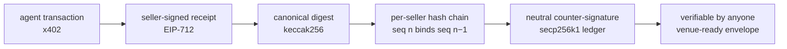

<p align="center">
  <a href="https://tersign.ai"></a>
</p>

<p align="center">
  <a href="https://www.npmjs.com/package/tersign"></a>
  <a href="https://github.com/tersignhq/tersign-js/blob/main/LICENSE"></a>
  
  
</p>

**Tersign is the evidence layer for the agent economy** — a neutral, counter-signed, hash-chained ledger for agent commerce. Sellers sign EIP-712 receipts; Tersign chains them per seller and counter-signs every entry. When the dispute comes, the transcript is already sealed.

> **Venues rotate. The transcript endures.**

---

## Verify a Real Entry — Right Now

No account. No API key. This is the genesis receipt, `seq 1` on the production chain. It is a self-signed demo: Tersign signed it as seller and named its own key as payer, so its EIP-712 payload signature (domain `{name: "x402 receipt", version: "1", chainId: 1}`, per the x402 offer-and-receipt extension) recovers to the payload's own payer, `0x36f82906859E5B0bd076069f8cdfAea355358b14`. [`/v1/genesis`](https://tersign.ai/v1/genesis) serves the record with the recipe for each of its signatures.

```sh
npx tersign verify 0xe5874f1ffe87f0a6dd9eb157730f67b86ee4538b125fe30fcc4e165213dd3fc4
```

```text
ledger:    https://tersign.ai
           reports: found, counter-signed chain intact (seller tersign-first, seq 1, …) — not checked locally
VALID (ledger-reported) — https://tersign.ai reports the record and its counter-signed chain; nothing was verified locally
```

`npx tersign verify <receipt.json | 0xdigest> [--signer 0xaddr] [--ledger url]` takes a receipt file or a digest.

- A **receipt file** is checked locally and touches no network unless you add `--ledger`. The EIP-712 signature is recovered, and `--signer` compares it with the issuer's address, which you take from the issuer through a channel you trust, never from the receipt. Without `--signer` the signer is reported `UNAUTHENTICATED` and the verdict reads `VALID (signer UNAUTHENTICATED)`: recovery yields an address for any payload, so an edited receipt reaches that same line with a different address.
- A receipt signed with a **published test key** (the 20 Hardhat/Anvil default dev-mnemonic accounts, or private key 1, 2 or 3) is flagged `published test key` either way: anyone can produce that signature. Fields in the file that the signature does not cover are listed by name, and a signed field in another JSON type (`"version": "1"`) is refused. The signature must be the one canonical encoding (`0x` + 130 lower-case hex digits, v 27/28, low-s): a re-encoding of a genuine signature (v 0/1, upper-case hex, the high-s twin) also recovers the issuer, under a different digest, so it is refused.
- The file is a receipt, `{receipt, record}`, or an evidence-bundle record file (`records/NNNNNN.json`, verdict qualified `record artifact only`: its chain fields are not checked here). Anything else that nests a receipt — a second receipt at the top level, or any other field beside it — is refused, because a reader would take those fields for the receipt that was checked. Duplicate keys and non-integer numbers are refused too.
- A **digest** is looked up on the Tersign ledger unless `--ledger` names another; the answer is that ledger's own counter-signed chain check, nothing in it is re-verified locally, and the verdict says so (`VALID (ledger-reported)`). The ledger consulted is always printed. The local check is the receipt file with `--signer`.

Exit status: `0` valid (read the last line — for a file, a bare `VALID` means a bound, non-test-key signer on a receipt or `{receipt, record}`; a digest is always `VALID (ledger-reported)`), `1` invalid, `2` usage (an unknown or valueless flag, `--signer` with a digest, a missing or non-JSON file). Prefer raw HTTP? The same proof, no CLI:

```sh
curl https://tersign.ai/v1/receipts/0xe5874f1ffe87f0a6dd9eb157730f67b86ee4538b125fe30fcc4e165213dd3fc4/verify
```

## One-Call Disclosure Evidence

Counter-signed evidence that your agent presented a disclosure — one command, no account:

```sh
npx tersign disclose "You are chatting with an AI assistant." --medium chat --agent-id my-agent
```

The text is digested **locally** (only the digest travels — data-minimization by construction). Your key signs the record; the ledger counter-signs it into a per-signer hash chain whose head is submitted for Bitcoin anchoring on a six-hourly cron. The first call self-provisions a free signer-keyed account bound set-once to your key, unless that key is already registered to an API-key ledger account (409: submit through that account) or the day's provisioning caps are reached (429). Key resolution: `TERSIGN_SELLER_KEY` env → macOS keychain `tersign-signer` → `~/.tersign/signer.key`, created on first use. Free tier is quota- and rate-limited — [limits](https://tersign.ai/pricing). What this is: independently verifiable evidence the disclosure was attested at that time. What it is not: a compliance certification.

## Chain of Custody

Every entry takes the same path: the seller **signs** the receipt (EIP-712, x402 offer-receipt extension) → Tersign computes the **keccak256 canonical digest** → the digest joins that **seller's hash chain**, each `seq n` bound to `seq n−1` → the neutral ledger **counter-signs** (secp256k1) → **anyone verifies**, and any venue gets a serialized envelope.

Since 2026-08-28 each anchor stamps a chain commitment — an accumulator over every counter-signed link — so one anchored digest covers the whole prefix; rows anchored earlier bind the head record only and say so (`subjectSchema`).


```mermaid
graph LR
    A["agent transaction<br/>x402"] --> B["seller-signed receipt<br/>EIP-712"]
    B --> C["canonical digest<br/>keccak256"]
    C --> D["per-seller hash chain<br/>seq n binds seq n−1"]
    D --> E["neutral counter-signature<br/>secp256k1 ledger"]
    E --> F["verifiable by anyone<br/>venue-ready envelope"]
```

<sub>Diagram renders on GitHub. On npm, the paragraph above IS the diagram.</sub>

A refund record references the record it corrects by digest (`refundOf`). Disputes attach to the digest with objective reason codes. Party statements are structurally segregated behind an `UNVERIFIED` marker — the evidence stays prompt-injection-hardened.

## Enter the Record

```sh
npm i tersign
```

`withAssure()` wraps your x402 fetch handler. On a settled call it signs a receipt and a compliance-fields record with your key and merges both into the `PAYMENT-RESPONSE` header, the base64 JSON settlement response x402 wallets already read; the response body is left alone. When it cannot issue them (a settlement network that is neither CAIP-2 nor a v1 name in its table, such as `"bsc"`, or a ledger error), the paid response goes out exactly as your handler returned it, with no receipt, and the error goes to `onError` (default: `console.error`); with idempotency on, a retry with the same payment id replays that response. On a 402 it adds `compliance-fields` to the `PAYMENT-REQUIRED` header. When the `Assure` is built with a ledger, the ledger counter-signs the receipt into your chain; the compliance-fields record is not counter-signed, and is bound to its receipt only by your own signature, which covers the receipt's digest. Without a ledger, both carry your signature alone.

```ts
import { privateKeyToAccount } from 'viem/accounts';
import { Assure, withAssure } from 'tersign';

const signer = privateKeyToAccount(process.env.TERSIGN_SELLER_KEY as `0x${string}`);
const assure = new Assure({ signer, issuer: { name: 'Example API Ltd', jurisdiction: 'HK' } });
export default { fetch: withAssure(app.fetch, { assure }) }; // app: your x402-protected Hono app
```

A wallet finds the receipt at `extensions["offer-receipt"].info.receipt` and the record at `extensions["compliance-fields"].info.record` of the decoded `PAYMENT-RESPONSE` (`X-PAYMENT-RESPONSE` on x402 v1). Sellers whose readers still parse the JSON body can pass `legacyBodyPlacement: true` for one more minor release.

The full register:

| Capability | In the record |
|---|---|
| Receipts | Seller-signed EIP-712 (x402 offer-receipt extension), keccak256 canonical digests |
| `withAssure()` | x402 fetch-handler adapter — receipt + compliance-fields record in `PAYMENT-RESPONSE` on each paid call it can issue for, the paid response passed through unchanged when it cannot; `compliance-fields` advertised on 402 |
| Compliance-fields records | MINIMAL tier (Art 226b simplified-invoice content) via `buildMinimalRecord` · ledger exports `format=art226b` · `format=s51c` — mappings, not certifications |
| Action records | `ActionRecordV1` — GDPR-minimized; captures the content of an Art-50 disclosure so the disclosure itself is independently attested, not self-reported |
| Refunds | A refund record carries `refundOf`, the digest of the record it corrects · `record_refund` logs a pending refund entry on the ledger (not counter-signed) |
| Disputes v0 | Objective reason codes, evidence submission, adjudication |
| Venue envelopes | Internet Court (5,000-char slot) · Kleros ERC-1497 · UMA · generic |
| Evidence packs | `format=art50` · `format=safr` (beta) |
| Idempotency | In-memory + Cloudflare D1 stores |
| `tersign intercept` | Audit capture at the MCP boundary — a signed, digest-only action record per tool call (experimental) |

## Capture at the MCP Boundary — `tersign intercept`

An agent's tool calls are usually recorded, if at all, by the party running the agent. Put a
recording clamp on the wire instead:

```sh
npx tersign intercept -- npx your-mcp-server
```

The proxy is a **pure observer**: bytes reach the server and the client exactly as sent, in
order, unmodified. Every `tools/call` it sees becomes an `ActionRecordV1` signed by *your* key
and counter-signed into a hash chain — **digests only**, so the record proves what happened
without carrying arguments or results anywhere. Records go to a configured ledger, and fall
back to a local `~/.tersign/intercepts-<date>.jsonl` so evidence is never silently dropped.

Experimental, and deliberately unopinionated about where the protocol lands: it implements the
observation semantics of the audit-mode validator described in MCP **SEP-2624** (Draft) as a
transport-level proxy today, and is structured to move onto the interceptor primitive if and
when that stabilizes. It makes no conformance claim to that draft.

## For Agents — the MCP Server

`npx tersign` starts the MCP server (stdio). Official registry entry: `io.github.tersignhq/evidence` (active).

```json
{
  "mcpServers": {
    "tersign": {
      "command": "npx",
      "args": ["tersign"]
    }
  }
}
```

No configuration is needed. With `TERSIGN_SELLER_KEY` unset or empty, the server signs with the key in the macOS keychain (`tersign-signer`) or `~/.tersign/signer.key`, and generates one there on first run; the key never leaves your machine. Set `TERSIGN_SELLER_KEY` only to bring your own.

**Tools** — `issue_receipt` · `verify_receipt` · `verify_compliance_record` · `record_disclosure` · `record_refund` · `open_dispute` · `submit_dispute_evidence` · `adjudicate_dispute` · `get_dispute`

| Env var | Required | Purpose |
|---|---|---|
| `TERSIGN_SELLER_KEY` | no | your own 0x-prefixed signing key; unset or empty, the keychain or keyfile key is used (generated on first run). If your ledger account has a registered signing key, set that key here: the ledger rejects respondent dispute evidence signed by any other key |
| `TERSIGN_LEDGER_URL` | no | ledger for counter-signing + chain checks; needed by the dispute tools; `record_disclosure` defaults to `https://tersign.ai` |
| `TERSIGN_LEDGER_API_KEY` | no | your seller API key on that ledger; with the seller id, enables `record_refund` and chained `issue_receipt`; also authenticates respondent dispute evidence |
| `TERSIGN_LEDGER_SELLER_ID` | no | your seller id on that ledger; with the API key, enables `record_refund` and chained `issue_receipt` |
| `TERSIGN_ISSUER_NAME` | no | issuer name stamped on action records |
| `TERSIGN_ISSUER_JURISDICTION` | no | issuer jurisdiction stamped on action records |
| `TERSIGN_ISSUER_TAX_ID` | no | issuer tax / business-registration id stamped on action records |

Cold to counter-signed in one session, with no configuration: call `record_disclosure`, then check the `digest` it returns with `npx tersign verify <digest>` (a bare digest checks against https://tersign.ai). `issue_receipt` counter-signs as well once `TERSIGN_LEDGER_URL`, `TERSIGN_LEDGER_API_KEY` and `TERSIGN_LEDGER_SELLER_ID` are set; without them it returns a locally signed, unchained receipt.

The agent skill `tersign-evidence` ships at [tersignhq/skills](https://github.com/tersignhq/skills).

## The Live Record

- **Ledger + dashboard** — public verify page: https://tersign.ai/verify
- **Census** — hash-chained observations across the live x402 seller catalog, probed autonomously; the numbers are served live, never quoted stale: https://prober.tersign.ai/v1/prober/stats
- **Conformance** — RFC 8785 (JCS) canonical serialization, keccak256 digests, and the public two-sided vector suite (canonical bytes, number domain, content address, chain continuity, completeness, anchored existence, phase separation, offer binding, independence — every criterion carrying both an accepting and an adversarial vector): [tersignhq/evidence-record-conformance](https://github.com/tersignhq/evidence-record-conformance). Reproduce the bytes and your implementation is conformant — in any language.
- **Standards** — the `compliance-fields` extension — a typed compliance-record schema plus four evaluator-side disqualifications (independence, completeness/existence, economic-phase separation, and commitment scope — an independence claim reaches exactly as far as the record's own commitments), each executable as a two-sided conformance vector — is under review upstream ([x402-foundation/x402#2853](https://github.com/x402-foundation/x402/pull/2853)) and referenced in the x402 TSC's evidence-record charter agenda ([tsc#4](https://github.com/x402-foundation/tsc/issues/4)). The merged offer-receipt spec already carries post-session verification guidance — signer authorization evaluated as of `issuedAt`, with mutable-source rotation handled explicitly ([#2811](https://github.com/x402-foundation/x402/pull/2811), merged); the completeness, independence, existence and phase disqualifications are the open extension's normative core.

## Machine Surfaces

Full URLs, readable without auth. If you are an agent, start here.

| Surface | Address |
|---|---|
| npm package | `tersign` — https://www.npmjs.com/package/tersign |
| MCP registry | `io.github.tersignhq/evidence` — `npx tersign` needs no configuration; `record_disclosure`'s first call self-provisions a signer-keyed account, unless the key is registered to an API-key account (409) or the daily provisioning caps are reached (429) |
| ARD catalog (Agentic Resource Discovery) | https://tersign.ai/.well-known/ai-catalog.json |
| Verify API | `GET https://tersign.ai/v1/receipts/{digest}/verify` |
| Envelope API | `GET https://tersign.ai/v1/receipts/{digest}/envelope?venue={internet-court\|kleros\|uma\|generic}` |
| Ledger stats | `GET https://tersign.ai/v1/stats` |
| Ledger signer | `GET https://tersign.ai/v1/ledger` |
| Bundle verifier, out-of-band | https://tersign.ai/verify/v1/ — `verify_bundle.py` · `keccak.py` · `secp256k1.py` · `SHA256SUMS`. A bundle ships its own checker; for evidence from an interested party fetch this copy and diff the two. |
| llms.txt | https://raw.githubusercontent.com/tersignhq/tersign-js/main/llms.txt |
| Conformance vectors (RFC 8785 + keccak256, two-sided) | https://github.com/tersignhq/evidence-record-conformance |
| Sample compliance-fields record + digests | https://github.com/tersignhq/tersign-js/blob/main/test/fixtures/compliance-record.json |
| Genesis verify | `npx tersign verify 0xe5874f1ffe87f0a6dd9eb157730f67b86ee4538b125fe30fcc4e165213dd3fc4` |

---

## Contributing — read this before opening a pull request

**`tersignhq/tersign-js` is a publish snapshot, not the development repository.** Each release
overwrites `src/`, `test/` and the packaged manifests wholesale from an upstream working tree, so
a pull request opened here cannot be merged in any durable way — the next release would silently
erase it. That is a property of the pipeline, not a judgement on the change.

Contributions are wanted; the mechanics just have to route around that:

- **Bugs, questions, spec disagreements** — open an issue here. Issues are read, and they are the
  right surface for anything that does not need to touch this tree.
- **Code changes** — open the issue first with the diff or a description. The change is applied
  upstream **preserving your authorship**, released, and the issue closed with a link to the
  version that carries your work. Credit follows commit authorship, not a merge badge.
- **Conformance disagreements** — the two-sided vector suite at
  [tersignhq/evidence-record-conformance](https://github.com/tersignhq/evidence-record-conformance)
  takes pull requests normally, and is the better venue for "this criterion is wrong" or "here is
  the case it misses." External vectors have been merged there.

If a maintainer ever asks you to reopen work elsewhere because of this, that is why.

---

<p align="center">
  
</p>

<p align="center"><sub>MIT · built and published from <a href="https://github.com/tersignhq/tersign-js">tersignhq/tersign-js</a> via trusted-publishing CI, provenance attested · Python verifier: <code>pip install tersign</code></sub></p>

<p align="center"><sub><b>Venues rotate. The transcript endures.</b></sub></p>

